# 화면설계서 — Callog(콜록) (팀 헬포)

- 기준 자료: 3강 워크시트(화면 흐름/화면 구조 문서), 4강 워크시트(화면 설계, 확정 화면 3개), 8/12 데모(index_0812.html) 실제 클릭 검증, PRD_통합본.md 3차 개정
- **호칭**: 어르신 / 보호자 (자녀·보호자를 통칭)
- **화면 구성 표현**: "확정 화면 3개"는 **사용자 그룹**(어르신 화면 / 보호자 화면 / 메인·로그인 화면) 기준이며, 실제 구현 범위는 그 안에 있는 **19개 세부 화면**이다(2026-08-30 기준, 초기 13개에서 비밀번호 찾기/재설정·이용약관·관리자 대시보드·어르신 홈·영상편지 모아보기 추가 — §2~4에 반영 완료). 발표 자료에서 "3개"만 단독으로 쓰면 스코프가 작아 보일 수 있으니 "3개 그룹 · 19개 화면"으로 함께 표기할 것.
- **가족 구조**: 1가족(보호자 계정) : N어르신 구조가 확정되어, 아래 흐름도의 "대상자 목록"은 더 이상 모순이 아니라 정식 스펙이다.
- ✅ **§7 와이어프레임은 2026-10-02에 전부 재캡처했다.** 실제 구동 중인 Callog 프로덕션 빌드를 375×812(모바일) 뷰포트로 찍은 것이라, 옛 이름("헬포")·전화번호 인증 기준이던 8/12 데모 화면은 더 이상 쓰지 않는다.

## 1. 전체 화면 흐름

```
[보호자 흐름]
시작(역할 선택)
 └ 보호자로 시작하기
    └ 계정 만들기 (이메일 인증 1/4 → 비밀번호 → 어르신 정보 → 지병 선택)
       └ 어르신 등록 (성함/생년월일/관계·성별(제안)/안부 묻는 시각)
          └ 지병 선택 (사전 정의 칩 + 직접 입력, 질문 미리보기 + 위험 가중치 설명)
             └ 초대 링크 (문자로 보내기, 1회용)
                ├─(반복)─→ "어르신 추가" — 같은 가족 계정에 어르신을 계속 등록 가능 (1:N)
                └ [어르신이 링크를 열면]
                   └ 대상자 목록 (여러 어르신을 우선순위 대시보드로 확인)
                      └ 대상자 상세 (위험 사유, 전화하기/확인했어요)
                      └ 영상편지 보내기

[어르신 흐름]
초대받은 화면 (TTS 안내, 시작하기)
 └ 오늘의 안부 (1~6번 선택형 체크리스트, 지병별 문항)
    └ 말하기 안부 (마지막 1문항, 자유 음성 — 보호자에게 한마디)
       └ 완료·편지 (스트릭 표시, 도착한 영상편지 열람)
          └ 영상편지 남기기 (녹화)
```

## 2. 화면 목록

| # | 화면 ID | 화면명 | 역할 | 핵심 목적 | 다음 화면 |
|---|---|---|---|---|---|
| 1 | gStart | 시작 | 보호자 | 신규/기존 계정 분기 | 계정 만들기 |
| 2 | signup | 계정 만들기 (1/4) | 보호자 | **이메일 인증** (전화번호 인증에서 변경) | 어르신 등록 |
| 3 | reg | 어르신 등록 (2단계 중 1) | 보호자 | 성함·생년월일·관계(성별 제안)·안부 시각 입력 | 지병 선택 |
| 4 | cond | 지병 선택 (2/2) | 보호자 | 지병 선택(칩+직접입력) → 맞춤 문항 미리보기 | 초대 링크 |
| 5 | invite | 초대 링크 | 보호자 | 1회용 링크 생성·문자 발송, "어르신 추가"로 반복 가능 | 대상자 목록 |
| 6 | gList | 대상자 목록 | 보호자 | 여러 어르신의 우선순위별 확인 대시보드 (1:N) | 대상자 상세 / 영상편지 보내기 |
| 7 | gDetail | 대상자 상세 | 보호자 | 위험 사유 확인, 대응 액션 | 전화하기 / 확인했어요 |
| 8 | gLetter | 영상편지 보내기 | 보호자 | 어르신에게 영상편지 녹화·전송 | 대상자 목록 |
| 9 | eInvited | 초대받은 화면 | 어르신 | 온보딩, TTS 안내 | 오늘의 안부 |
| 10 | eCheck | 오늘의 안부 | 어르신 | 지병 맞춤 체크리스트(1~6번) | 말하기 안부 |
| 11 | eSpeech | 말하기 안부 | 어르신 | 마지막 자유 음성 질문 | 완료·편지 |
| 12 | eDone | 완료·편지 | 어르신 | 완료 축하, 연속 참여 기록, 편지 열람 | 영상편지 남기기 |
| 13 | eRecord | 영상편지 남기기 | 어르신 | 보호자에게 영상편지 녹화 | 완료·편지로 복귀 |
| 14 | terms | 이용약관 | 메인 | 의료기기 아님·응급구조 아님 등 면책 조항 고지 | 계정 만들기 |
| 15 | forgot | 비밀번호 찾기 | 메인 | 가입 이메일 입력 → 재설정 메일 발송 | 비밀번호 재설정 |
| 16 | reset | 비밀번호 재설정 | 메인 | 새 비밀번호 입력·확인 | 시작(로그인) |
| 17 | gAdmin | 관리자 대시보드 | 보호자(팀 내부) | 화이트리스트 계정 전용, 전체 어르신 위험도 현황 한눈에 확인 | 대상자 상세 |
| 18 | eHome | 어르신 홈 | 어르신 | 안부 시작 전 메인 화면, 글씨 크게 등 화면 설정 | 오늘의 안부 |
| 19 | eLetters | 영상편지 모아보기 | 어르신 | 그동안 받은 영상편지 목록 열람 | 완료·편지로 복귀 |

## 3. 화면별 상세 (사용자 / AI / 데이터)

| 화면 | 사용자 행동 | AI 처리 | 관련 데이터 |
|---|---|---|---|
| 오늘의 안부 (eCheck) | 지병 관련 체크리스트 응답(복약, 식사, 외출 등), 컨디션 선택 | 다음 날 문항 구성 변경, 응답 패턴 분석 준비 | 어르신 건강 데이터, 건강 표준 데이터, 검사 선지, 지병 목록 |
| 말하기 안부 (eSpeech) | 짧은 자유 음성으로 답변 | **Gemini API**로 음성을 직접 분석해 발화 속도·침묵 비율·응답 지연 등 인지기능 신호 후보 산출 (기존 STT+규칙기반에서 변경, [기능설계서.md](기능설계서.md) 참고) | 음성 녹음, Gemini 분석 결과, 이전 발화 기록(개인 7일 평균) |
| 대상자 목록 (gList) | 여러 어르신을 위험도 순으로 정렬해 확인 | 체크리스트·음성 데이터를 과거 기록과 비교해 위험도 산정, 변화 감지 (어르신별 개별 산정) | 이전 설문 결과, 위험도 이력 |
| 대상자 상세 (gDetail) | 위험 사유 확인 후 전화하기 또는 확인했어요 선택 | 위험 사유 텍스트 생성(예: "일곱 시간 동안 대답이 없습니다") | 응답 시간 로그, 복약/외출 기록 |
| 영상편지 (gLetter/eRecord) | 영상 녹화 후 전송/열람 | **Gemini 영상 분석 활용 예정** — 정확한 분석 목적은 [기능설계서.md](기능설계서.md) 오픈 이슈 참고(기존 "안색·표정 진단 배제" 결정과 충돌 여부 미확정) | 영상 파일, 발신·수신 관계 |

## 4. 확정 화면 3개(그룹)와 세부 화면 매핑

| 확정 화면(그룹) | 포함되는 세부 화면 | 세부 화면 수 |
|---|---|---|
| 메인(로그인) 화면 | 시작(gStart), 계정 만들기(signup), 이용약관(terms), 비밀번호 찾기(forgot), 비밀번호 재설정(reset) | 5 |
| 어르신 화면 | 초대받은 화면, 어르신 홈(eHome), 오늘의 안부, 말하기 안부, 완료·편지, 영상편지 남기기, 영상편지 모아보기(eLetters) | 7 |
| 보호자 화면 | 어르신 등록, 지병 선택, 초대 링크, 대상자 목록, 관리자 대시보드(gAdmin), 대상자 상세, 영상편지 보내기 | 7 |

## 5. 온보딩 예외 처리

| 상황 | 감지 방법 | 처리 | 영향 화면 |
|---|---|---|---|
| 휴대폰 분실(어르신) | 보호자가 "재초대" 요청 | 기존 토큰 무효화, 새 1회용 링크 발급·재발송 | 대상자 상세(gDetail), 초대 링크(invite) |
| 기기 변경(새 폰 구매) | 새 기기에서 접속 시 기기 식별자 불일치 | 기존 링크 만료 처리, 보호자가 재초대해야 새 기기 연결 | 초대 링크(invite) |
| 초대 링크 유출/오전달 | 미등록 기기에서 최초 개봉 시도 | 최초 개봉 기기에만 종속되므로 이후 다른 기기 접근 자동 차단 | 초대받은 화면(eInvited) |
| 링크 만료 후 미접속 | 발급 후 일정 기간 미개봉 | 보호자에게 "아직 연결되지 않았어요" 안내, 재발송 유도 | 대상자 목록(gList) |
| **(신규) 인증 이메일 미수신** | 계정 만들기에서 이메일 인증 대기 상태로 남음 | Resend 재발송 버튼 제공, 유효시간 넉넉히 설정 | 계정 만들기(signup) |

## 6. 데모 검증 결과 — 반영 여부

⚠️ 아래 표는 8/12 데모(구 호칭·전화번호 인증 기준) 대비 현재 확정 사항의 반영 여부이다. 서비스명·호칭·이메일 인증·Gemini 전환은 이 데모 이후에 결정된 사항이라 전부 "미반영" 상태다.

| 항목 | 상태 | 비고 |
|---|---|---|
| 지병 선택에 따라 질문/가중치 변경 | ✅ 반영 | 고혈압 1.5배, 당뇨병 2.4배 등 실제 표시됨 |
| TTS "읽어주기" 버튼 | ✅ 반영 | 전 화면 공통 |
| 1회용 초대 링크 | ✅ 반영 | 기기당 1회 개봉 후 만료 |
| 위험도 3단계(안전/위험/심각) 색상 구분 | ✅ 반영 | 대상자 목록에 빨강/주황 등 표시 |
| 안부체크 완료 후 영상편지 언락 | ✅ 반영 | 완료·편지 화면에서 확인 |
| 1가족-다어르신(1:N) 구조 | ✅ 확정 | 팀 논의로 확정 — 더 이상 범위 모순 아님, 대상자 목록이 정식 스펙 |
| 서비스명(Callog(콜록))·호칭(어르신/보호자) | ⚠️ 미반영 | 데모는 옛 이름 "헬포"·옛 호칭 "어르신/가족" 그대로 사용 |
| 이메일 인증 (전화번호 인증에서 변경) | ⚠️ 미반영 | 데모는 여전히 전화번호 인증 흐름 |
| Gemini 기반 음성/영상 분석 | ⚠️ 미반영 | 데모는 분석 로직 자체가 없는 정적 목업 |
| 어르신 등록 "관계" 유지 + "성별" 추가(제안) | ⚠️ 미반영 (팀 확인 대기) | 현재 데모는 "나와의 관계" 필드만 존재. 성별 필드 추가는 제안 단계 |
| 생년월일 필드 | ⚠️ 미반영 (확정은 됨) | 데모는 "나이" 입력, 생년월일로 교체 예정 |
| 지병 "직접 입력" 옵션 | ⚠️ 미반영 (확정은 됨) | 사전 정의된 칩만 존재, MVP 필수로 확정되어 다음 스캐폴딩에 추가 필요 |
| 대상자 목록 편집(우선순위 재배치) | ⚠️ 미반영 | 정적 목록, 자동 산정 등급을 수동 조정할지는 오픈 이슈로 남음 |
| 영상편지 녹화 안내 멘트("정면을 봐주세요") | ⚠️ 미반영 | 단순 "하고 싶은 말씀을 하세요"만 표시, 세부 문구는 오픈 이슈 |

## 7. 와이어프레임 (2026-10-02 재캡처)

실제 구동 중인 **Callog 프로덕션 빌드**를 캡처한 것이다. 이미지는 `docs/wireframes/`에 있고, 19개 화면이 모두 들어 있다(17번만 일부 영역 제외 — 아래 ※ 참고).

**캡처 조건** — 뷰포트 375×812(모바일), 2배 해상도(750×1624 PNG), 데이터는 더미 어르신("홍길동 / 어머니") 기준.
보호자 화면은 라이트, 어르신 화면은 다크로 보이는데 이는 `guardian.css` / `elder.css`로 의도해 분리한 디자인이다.

| # | 화면 ID | 화면명 | 경로 | 와이어프레임 |
|---|---|---|---|---|
| 1 | gStart | 시작 | `/` | 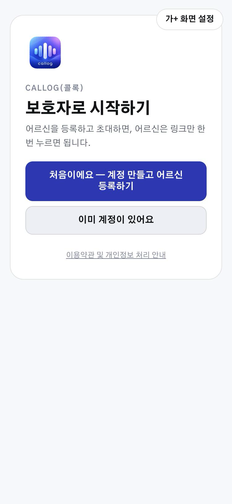 |
| 2 | signup | 계정 만들기 | `/signup` | 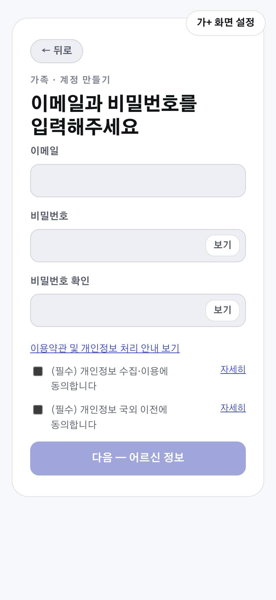 |
| 3 | reg | 어르신 등록 | `/guardian/elders/new` | 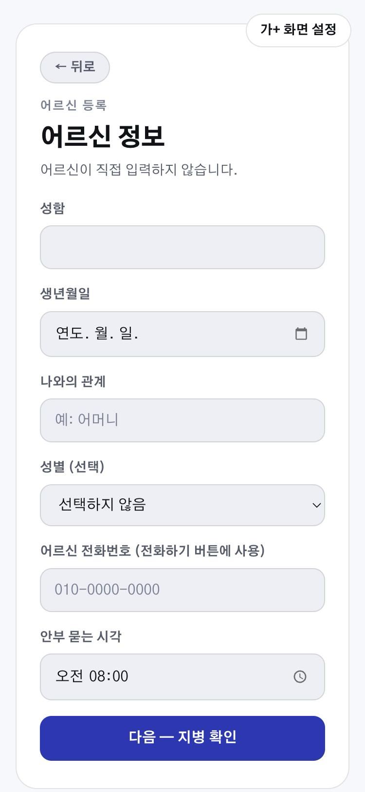 |
| 4 | cond | 지병 선택 | `/guardian/elders/:id/conditions` | 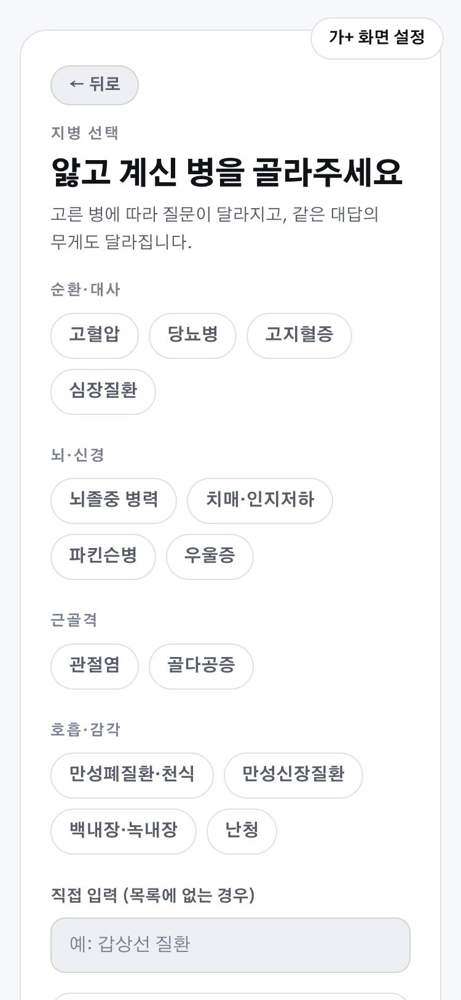 |
| 5 | invite | 초대 링크 | `/guardian/elders/:id/invite` | 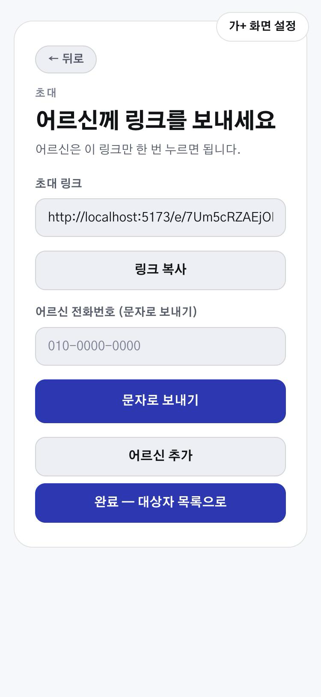 |
| 6 | gList | 대상자 목록 | `/guardian` | 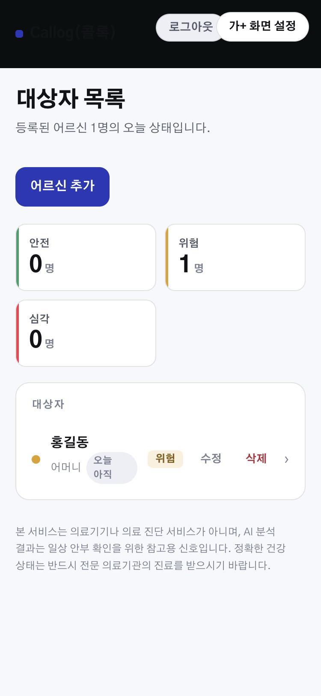 |
| 7 | gDetail | 대상자 상세 | `/guardian/elders/:id` | 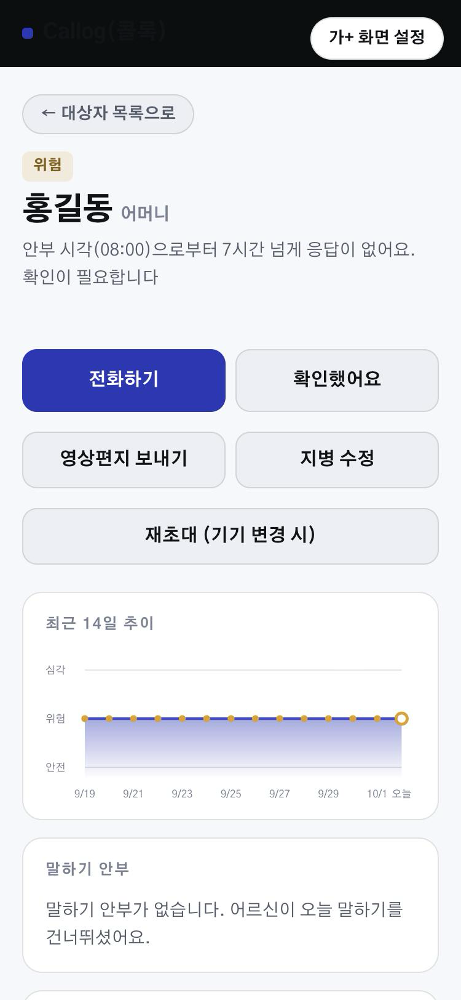 |
| 8 | gLetter | 영상편지 보내기 | `/guardian/elders/:id/letter` | 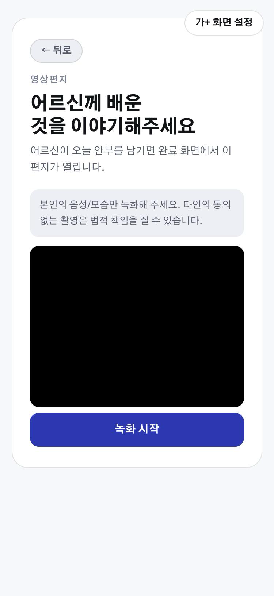 |
| 9 | eInvited | 초대받은 화면 | `/e/:token` | 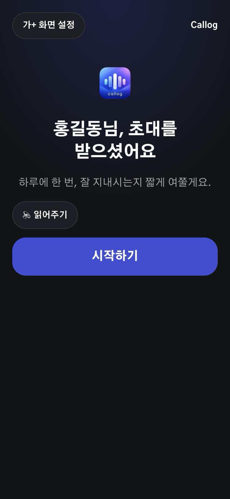 |
| 10 | eCheck | 오늘의 안부 | `/elder/check` | 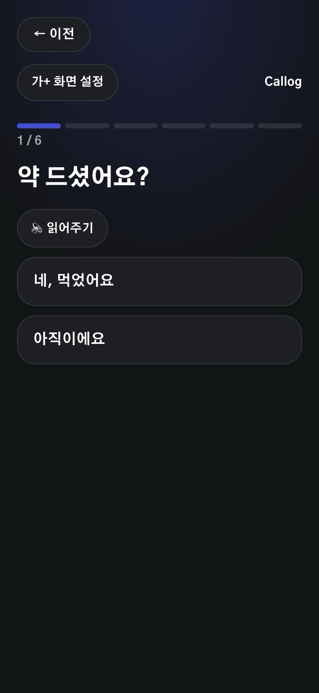 |
| 11 | eSpeech | 말하기 안부 | `/elder/speech` | 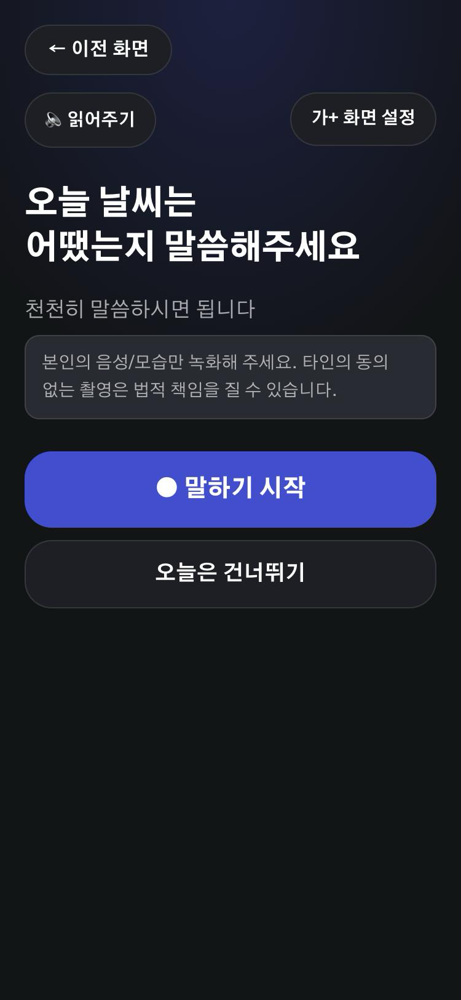 |
| 12 | eDone | 완료·편지 | `/elder/done` | 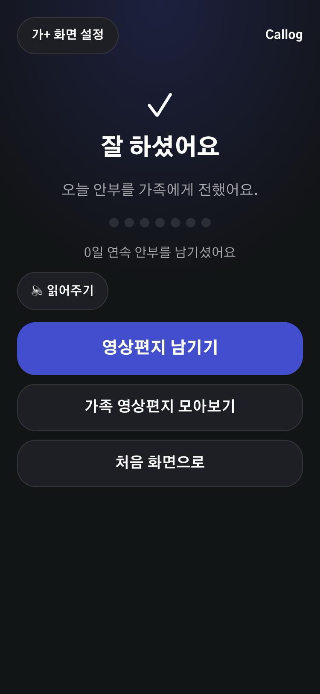 |
| 13 | eRecord | 영상편지 남기기 | `/elder/record` | 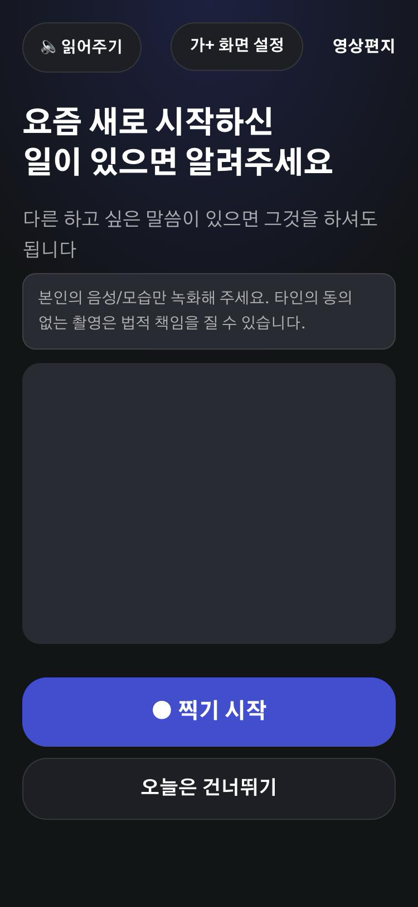 |
| 14 | terms | 이용약관 | `/terms` | 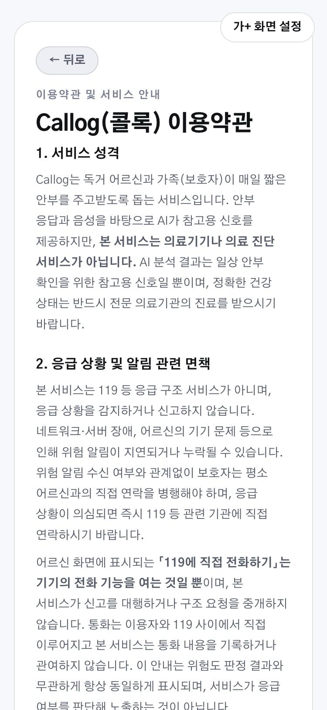 |
| 15 | forgot | 비밀번호 찾기 | `/forgot` | 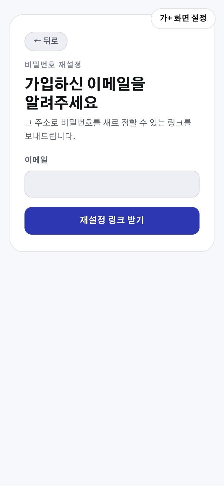 |
| 16 | reset | 비밀번호 재설정 | `/reset` | 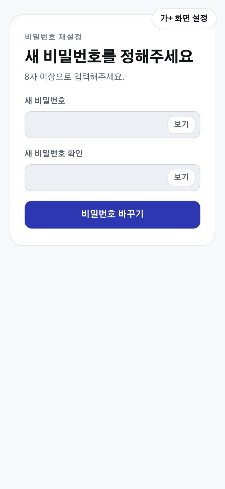 |
| 17 | gAdmin | 관리자 대시보드 | `/admin` | 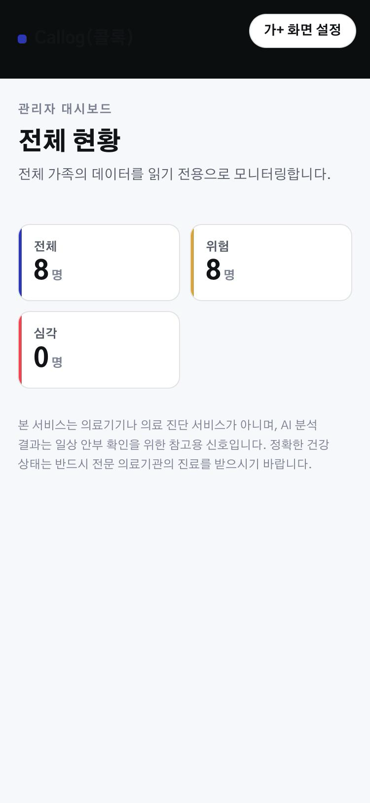 ※ |
| 18 | eHome | 어르신 홈 | `/elder/home` | 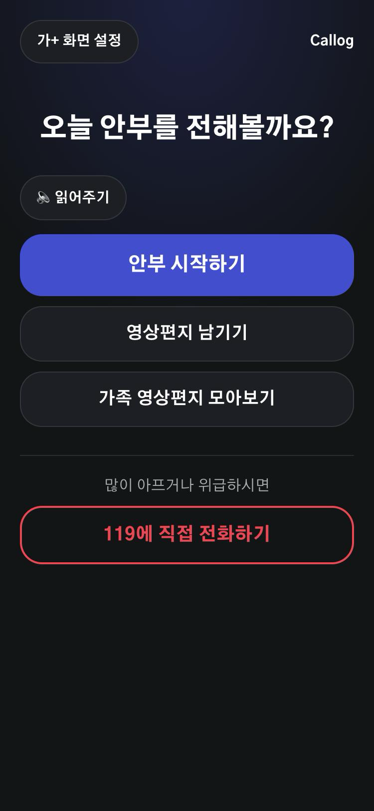 |
| 19 | eLetters | 영상편지 모아보기 | `/elder/letters` | 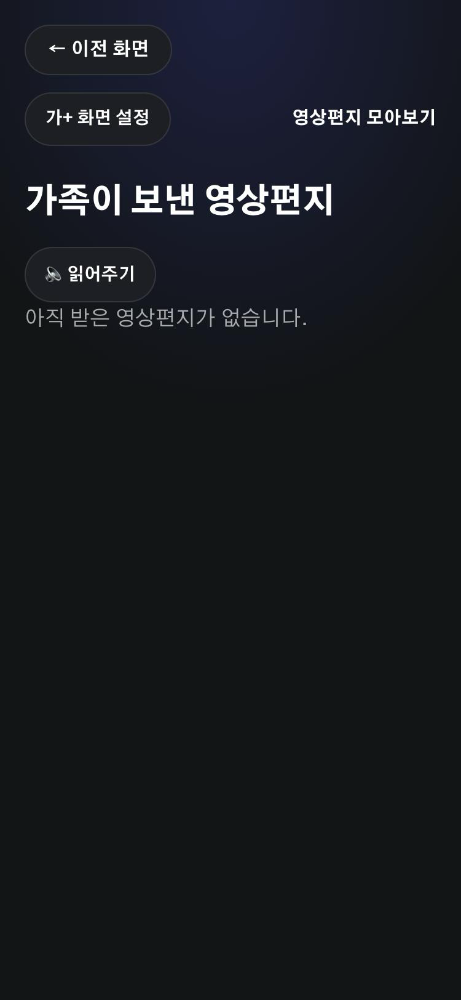 |

### ※ 17번(관리자 대시보드)은 요약 영역만 담았다

이 화면은 **전체 가족의 어르신 이름·보호자 이메일·위험 사유를 한 화면에 모아 보여준다.**
이 저장소는 public이라, 그대로 캡처하면 다른 가족 8세대의 이메일 주소가 공개된다.
그래서 **대상자 목록을 제외하고 상단 집계 카드(전체/위험/심각)까지만 담았다.**

레이아웃과 역할을 설명하는 데는 이것으로 충분하고, 목록 행의 구조는 §2의 `gList`(6번)에서
같은 형태로 확인할 수 있다. 전체 화면이 필요하면 공개하지 않는 경로로 따로 관리한다.

접근 권한: `admin_whitelist`에 등록된 계정만 열 수 있다. 등록되지 않은 계정으로 들어가면
"관리자 권한이 없습니다"만 표시된다.

### 재현 방법

```bash
cd demo/v1
npm run build && npm run preview -- --port 5173 --strictPort
```

**개발 서버(`npm run dev`)가 아니라 프로덕션 빌드로 찍어야 한다.** `eRecord`·`gLetter`·`eSpeech` 세 화면에는
`import.meta.env.DEV`로 감싼 "(개발용) 테스트 파일 사용" 버튼이 있어서, 개발 서버로 찍으면 실제 사용자가
보지 못하는 버튼이 와이어프레임에 들어간다. `ElderRoute`의 `?preview` 우회도 마찬가지로 개발 전용이라,
어르신 화면은 §2의 `invite` 화면에서 초대 링크를 받아 `/e/:token`으로 들어가야 한다(토큰은 방문할 때마다 새로 발급된다).

## 8. 다음 단계 제안

1. 성별 필드 추가 여부, 지병 직접 입력 UX, 대상자 목록 수동 편집 여부 — 팀 확인 후 화면 스펙 확정
2. Gemini 영상 분석의 정확한 범위(정서적 톤 vs 안색·표정)를 먼저 확정한 뒤 화면/기능 스펙에 반영
3. ✅ **완료(2026-10-02)** — §7 와이어프레임 19개를 프로덕션 빌드 기준으로 전부 재캡처했다. 관리자 대시보드는 다른 가족의 개인정보가 노출되지 않도록 요약 영역만 담았다
